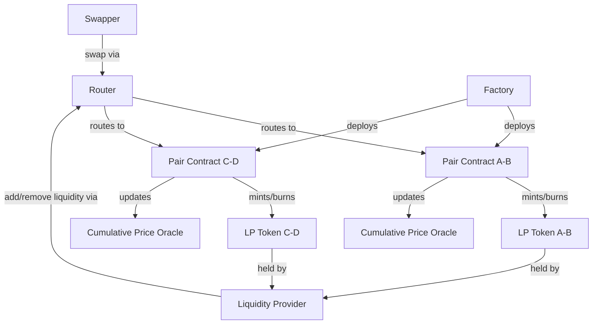

---
## Uniswap V2 — How It Works
_Researched: 2026-02-13_

Uniswap V2 is a decentralised exchange on Ethereum using a **constant product AMM** defined by **x * y = k**, where x and y are the reserves of two ERC-20 tokens. Liquidity providers (LPs) deposit equal value of both tokens into a **Pair contract** and receive **LP tokens** (ERC-20) representing their proportional share of the pool. These LP tokens are minted on deposit and burned on withdrawal. Every swap executes against the pool's reserves: a trader sends token A and receives token B, with the output determined by the constant product formula. Each swap incurs a **0.30% fee** — by default the entire fee goes to LPs. If the protocol fee switch is activated (`feeTo` set to a non-zero address), the split becomes 0.25% to LPs and 0.05% to the protocol. The fee mechanism causes k to increase over time.

The architecture has three core contracts. The **Factory** deploys **Pair** contracts via `CREATE2` (deterministic addresses) and maintains a registry of all pairs. Each **Pair** holds token reserves, executes swaps, mints/burns LP tokens, and maintains a **cumulative price oracle** (`price0CumulativeLast`, `price1CumulativeLast`) enabling external contracts to compute TWAPs. The **Router** is the recommended user-facing entry point: it routes multi-hop swaps, wraps/unwraps ETH via WETH, enforces slippage limits, and provides helper functions. While the Router is the standard interface, Pair contracts have public `swap()` functions — advanced users and smart contracts can interact with them directly for gas efficiency.

**Validation:** ✅ 8 verified, ⚠️ 2 imprecise, ❌ 0 incorrect
- ⚠️ Fee split (0.25/0.05) is a potential configuration, not the default — clarified above.
- ⚠️ Router-only interaction is a best practice, not a hard constraint — clarified above.

**Sources:**
- [Uniswap Concepts Overview](https://docs.uniswap.org/concepts/overview)
- [Uniswap V2 Contracts Overview](https://docs.uniswap.org/contracts/v2/overview)
- [Uniswap V2 Whitepaper (PDF)](https://uniswap.org/whitepaper.pdf)
- [Uniswap V2 — How It Works](https://docs.uniswap.org/contracts/v2/concepts/protocol-overview/how-uniswap-works)
- [Uniswap V2 — Fees](https://docs.uniswap.org/contracts/v2/concepts/advanced-topics/fees)
- [Uniswap V2 — Pair Reference](https://docs.uniswap.org/contracts/v2/reference/smart-contracts/pair)
- [Uniswap V2 — Factory Reference](https://docs.uniswap.org/contracts/v2/reference/smart-contracts/factory)
- [Uniswap V2 — Router02 Reference](https://docs.uniswap.org/contracts/v2/reference/smart-contracts/router-02)
---
